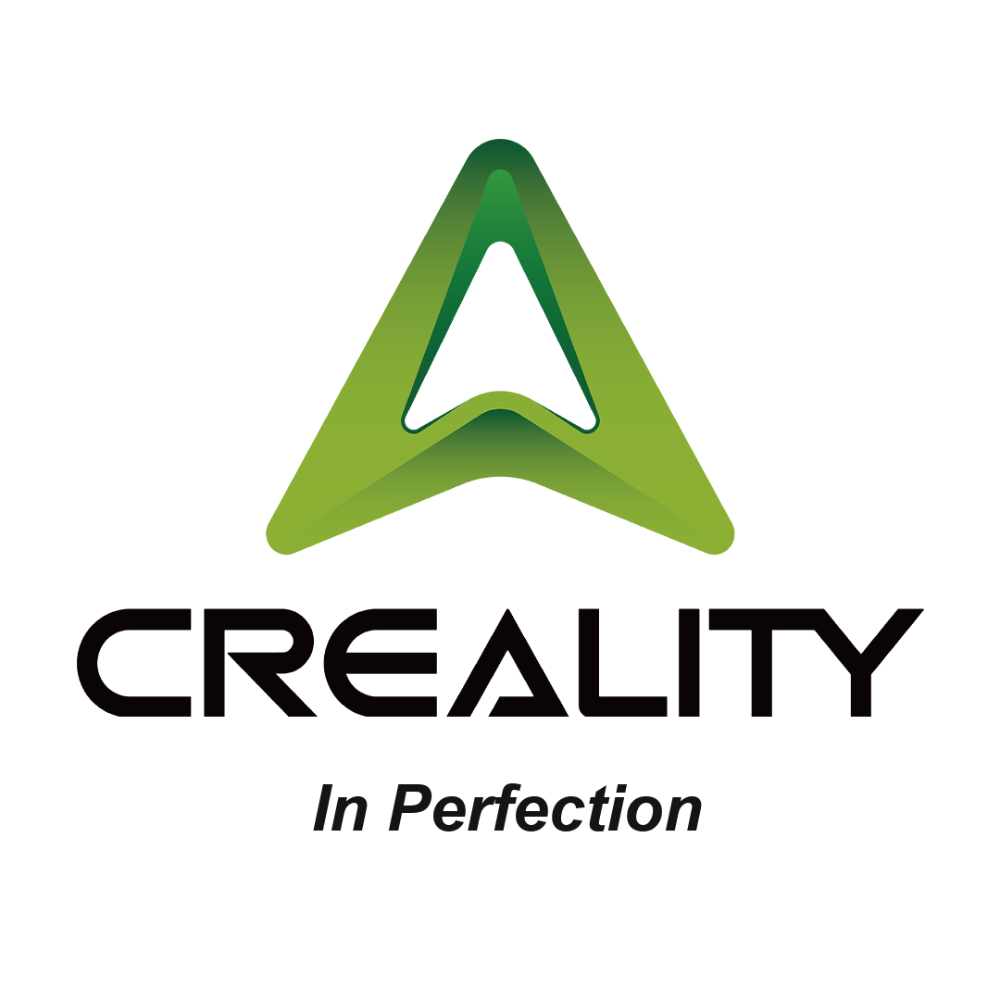
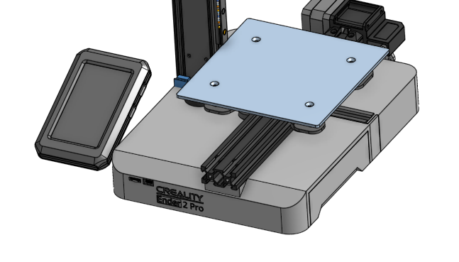

  

  
  

        <h1 align="center"><b>CIP - Ender 2 Pro</b></h1>
	      
 <strong>
	          	What does CIP mean: Creality in Perfection
			 
		      

        		We love the Creality printers but sometimes you feel they are just 90% finised
			 
	      		So we redo the 90% and adding the messing "15%"
</strong>
     
     
    <i>~ This project intends to become a community-driven project, not a brand. ~
      
     
    Preview: 
     
    </i>
         </a>
     
</a>
  

 

Status: **V0.1** [Work In Progress]  

 

## Contents

- [Modifications](#Modifications)
- [Print Parameters](#Print_Parameters)
- [Contact](#contact)
- [Credits](#credits)
- [Support](#support)
- [License](#license)

## Modificaions

 <b> Purchased Parts:
  
 
  	 - Standard Ender 2 Pro
 	 - Prite Extruder Pro Kit (incl. Carriage and harness)
  	 - CR Touch
   	 - Nebula Pad Kit
   	 - BTT SKR E3 V3
    	 - Powersuppler update: tbc
         - Liniar Rails: tbc
     

<b> Printed Parts:
    (All parts are in the correct Printorientation)
 
	<i>
	- xxx
	- 

</a>      

## Print Parameters

	Material: 	ASA, ABS (I use ABSx from Nobufil)		https://www.nobufil.com/
 		  	Enclosed calibrated Printer
     
 	Nozzel: 	0.4mm
  	Layerhight:	0.2mm
   	Outerwalls:	4
    Top & Bottom:	4
    Infill:		40%
      

## Contact

	Zirus.VAG@gmail.com

## Credits

 	Creality for giving us a very nice tiny platform to play with.

## Support

	Contact me if you want to support me

## License
Zirus-VAG/CIP-Ender_2_Pro is licensed under the GNU General Public License v3.0

